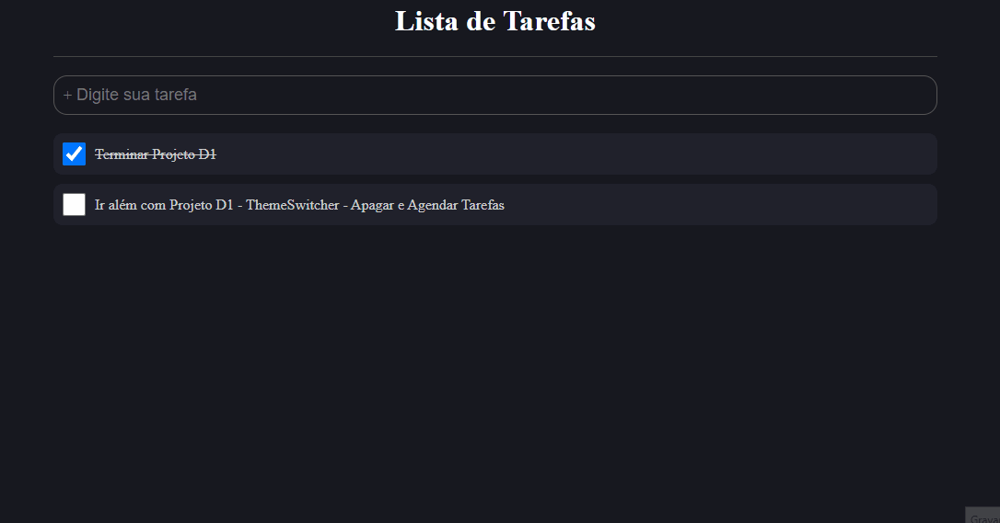

## Aplicativo para genreciar suas tarefas (Desafio B7Web 5 Em 5)

 <br>
 

<br>

## ⚙ Pré Requisitos

- Antes de iniciar o projeto, você vai precisar das seguintes ferramentas: 
    - ✔️ [VsCode](https://code.visualstudio.com/download);
    - ✔️ [Git](https://git-scm.com/)
    - ✔️ [NodeJS](https://nodejs.org/en/download/)

<br>

## 🚀 Tecnologias Usadas

Neste projeto foram usadas essas tecnologias:

- ✔️ [React](https://pt-br.reactjs.org/)

- ✔️ [Styled-components](https://styled-components.com/docs/basics#installation)

- ✔️ [TypeScript](https://www.typescriptlang.org/)


<br>

## Clonar o repositório
```bash
$ git clone https://github.com/FilipePaiva10/D1TaskReact.git
```

## Instalar dependências
```bash
npm install
```

## Rodar Projeto
```bash
npm start
```

